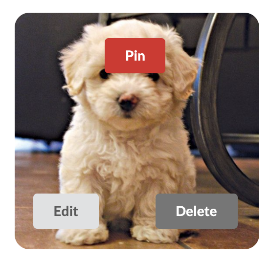
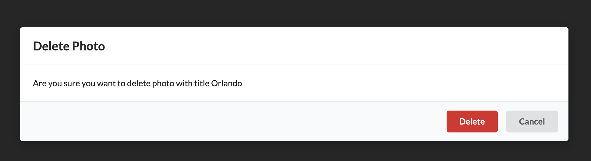

# Pinterest Clone

#### Simple Pinterest clone react app that utilizes redux, Google OAuth, portals, redux forms, and react router to provide CRUD functionality.

#### By Sarah "Sasa" Schwartz, April 2020

---

## Table of Contents

1. [Description](#description)
2. [Installation](#installation)
3. [Technologies Used](#technologies-used)
4. [Sample Images](#sample-images)
5. [Known Bugs](#known-bugs)

---

## Description

Simple Pinterest clone react app that utilizes redux, Google OAuth, portals, redux forms, and react router to provide CRUD functionality. You can log in with google, post photos, view all photos, view specific photo details, and edit/delete photos (but only if you were the one who posted them), and pin a photo to your board.

I learned the basics of how to structure and route this website from a wonderful Udemy course by Stephen Grider: Modern React with Redux.

## Installation

- clone repository to your desktop
- cd into client directory

  - npm install
  - npm start (starts app on localhost:3000)

- open second terminal window
- cd into api directory

  - npm install
  - npm start (starts api server)
  - (note that all data will be stored in db.json file in api directory)

## Technologies Used

- React
- React router
- Redux
- Redux thunk
- Redux form
- Google OAuth
- Portals (to create modals)
- json server (for running API)
- Semantic UI

## Sample Images

##### Homepage view of all photos

##### Hovering over a photo

##### Delete modal

## Known bugs

- User can log in an pin a photo, but if two users are both logged in, they can't pin the same photo. I believe this is because pinned photos are saved to state as a 'pins' object, and it won't allow creation of two identical pins with different 'pinnedBy' values. This is definitely an area for future exploration and improvement.

---

This project was bootstrapped with [Create React App](https://github.com/facebook/create-react-app).

## Available Scripts

In the project directory, you can run:

### `npm start`

Runs the app in the development mode. 
Open [http://localhost:3000](http://localhost:3000) to view it in the browser.

The page will reload if you make edits. 
You will also see any lint errors in the console.

### `npm test`

Launches the test runner in the interactive watch mode. 
See the section about [running tests](https://facebook.github.io/create-react-app/docs/running-tests) for more information.

### `npm run build`

Builds the app for production to the `build` folder. 
It correctly bundles React in production mode and optimizes the build for the best performance.

The build is minified and the filenames include the hashes. 
Your app is ready to be deployed!

See the section about [deployment](https://facebook.github.io/create-react-app/docs/deployment) for more information.

### `npm run eject`

**Note: this is a one-way operation. Once you `eject`, you can’t go back!**

If you aren’t satisfied with the build tool and configuration choices, you can `eject` at any time. This command will remove the single build dependency from your project.

Instead, it will copy all the configuration files and the transitive dependencies (webpack, Babel, ESLint, etc) right into your project so you have full control over them. All of the commands except `eject` will still work, but they will point to the copied scripts so you can tweak them. At this point you’re on your own.

You don’t have to ever use `eject`. The curated feature set is suitable for small and middle deployments, and you shouldn’t feel obligated to use this feature. However we understand that this tool wouldn’t be useful if you couldn’t customize it when you are ready for it.

## Learn More

You can learn more in the [Create React App documentation](https://facebook.github.io/create-react-app/docs/getting-started).

To learn React, check out the [React documentation](https://reactjs.org/).

### Code Splitting

This section has moved here: https://facebook.github.io/create-react-app/docs/code-splitting

### Analyzing the Bundle Size

This section has moved here: https://facebook.github.io/create-react-app/docs/analyzing-the-bundle-size

### Making a Progressive Web App

This section has moved here: https://facebook.github.io/create-react-app/docs/making-a-progressive-web-app

### Advanced Configuration

This section has moved here: https://facebook.github.io/create-react-app/docs/advanced-configuration

### Deployment

This section has moved here: https://facebook.github.io/create-react-app/docs/deployment

### `npm run build` fails to minify

This section has moved here: https://facebook.github.io/create-react-app/docs/troubleshooting#npm-run-build-fails-to-minify
